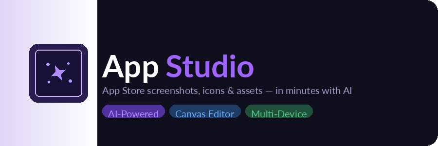

# App Studio

Your all-in-one App Store creative studio. Design marketing screenshots, generate app icons, and produce store assets — in minutes with AI and a powerful canvas editor.

## Features

- **Marketing Screenshots** — Design App Store screenshots with a powerful Konva-based canvas editor. Add device frames, text overlays, and backgrounds.
- **AI‑Powered Editing** — Describe what you want and let AI (Gemini via Vercel AI SDK) edit your canvas — change backgrounds, add text, rearrange elements instantly.
- **App Icon Generation** — Generate stunning app icons with AI. Create multiple variants and export at every required resolution.
- **Multi‑Device Presets** — iPhone 5.5″, 6.5″, 6.7″, iPad 11″/12.9″, and Mac presets built in. One project, every screen size.

## Tech Stack

- **Framework:** Next.js 16 (App Router), React 19, TypeScript 5
- **Styling:** TailwindCSS 4, Radix UI + shadcn components
- **Canvas:** Konva + react-konva
- **Database:** Turso (LibSQL/SQLite) + Drizzle ORM
- **Auth:** NextAuth v5 with RxLab OIDC provider
- **AI:** Vercel AI SDK + Google Gemini 3.1 Flash via AI Gateway
- **Storage:** Vercel Blob

## Getting Started

Install dependencies:

\`\`\`bash
bun install
\`\`\`

Set up environment variables (copy \`.env.example\` to \`.env.local\` and fill in the values):

\`\`\`
AUTH_ISSUER=
AUTH_CLIENT_ID=
AUTH_CLIENT_SECRET=
TURSO_DATABASE_URL=
TURSO_AUTH_TOKEN=
BLOB_READ_WRITE_TOKEN=
AI_GATEWAY_URL=
\`\`\`

Push the database schema:

\`\`\`bash
bun db:push
\`\`\`

Run the development server:

\`\`\`bash
bun dev
\`\`\`

Open [http://localhost:3000](http://localhost:3000) with your browser to see the app.

## Scripts

| Command | Description |
|---|---|
| \`bun dev\` | Start development server |
| \`bun run build\` | Production build (pushes DB schema then builds) |
| \`bun lint\` | Run ESLint |
| \`bun db:generate\` | Generate Drizzle migrations from schema |
| \`bun db:push\` | Push schema changes to Turso database |
| \`bun db:studio\` | Open Drizzle Studio (database UI) |

## Project Structure

\`\`\`
app/
  (app)/          # Authenticated routes (dashboard, editor)
  api/ai/edit/    # Streaming AI canvas editing endpoint
  login/          # Auth pages
actions/          # Server actions for all CRUD operations
components/
  editor/         # Canvas editor UI (toolbar, properties, export)
  ui/             # shadcn component library
hooks/            # useCanvasState, useAiEdit, useAutoSave
lib/
  db/             # Drizzle schema and client
  ai/             # AI tool definitions
  canvas/         # Canvas element types and defaults
  settings.ts     # Device presets (iPhone, iPad, Mac)
\`\`\`

## Deploy on Vercel

Refer to the [Next.js deployment documentation](https://nextjs.org/docs/app/building-your-application/deploying) for details.
